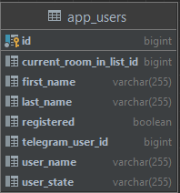
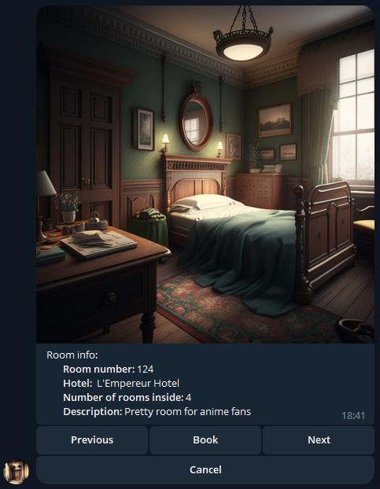

# Hotel Booking Telegram Bot
### Description
So, almost all of us use Telegram every day - to chat with friends, do some work stuff, maybe business tasks, etc. 
Also a lot of us often travel somewhere and usually such people need a place to stay. 
So, my project idea is to create a test telegram bot that simulate real hotel service for users to book rooms quickly and easily.

### Main technologies
* **Java**
* **Spring**
* **Maven**
* **Telegram API**
* **PostgreSQL**

### Main features
* **Registration:**  
When user starts sending messages to the bot for the first time, 
he has to use "/start" command, which immediately register this user in the database  
  
* **Rooms list view**  
When user use "/rooms" bot send him list of all available ones  
  